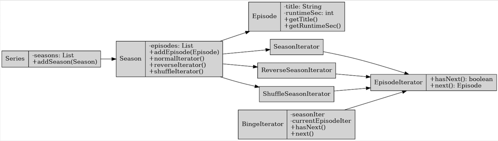
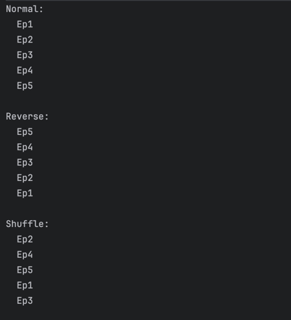
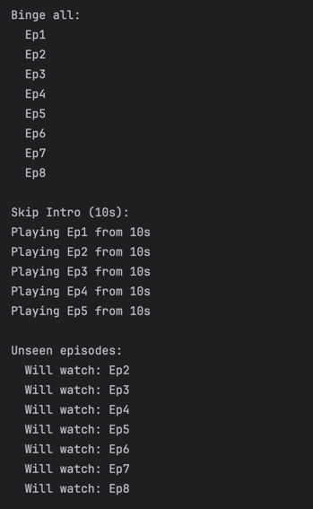
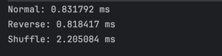
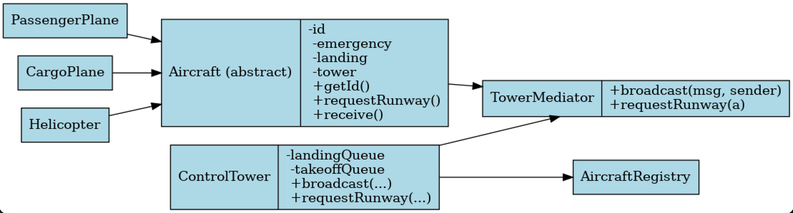
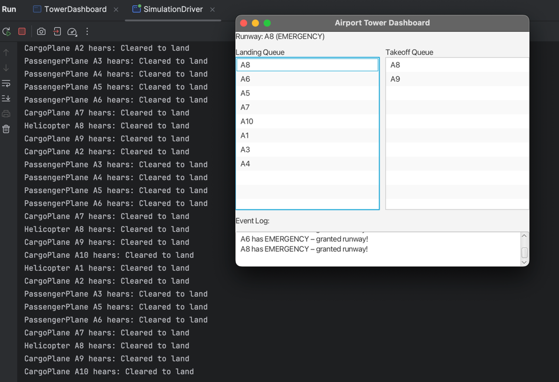
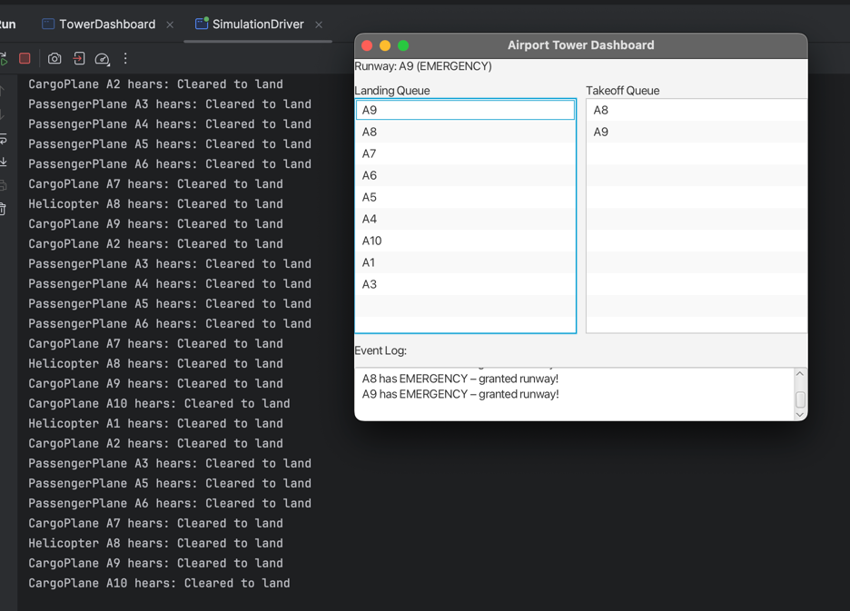

# Streaming-Service & Airport Tower Simulator

## Part 1 – Iterator Pattern: Streaming Service Binge Mode

### Overview
This part implements the Iterator design pattern to support flexible and uniform traversal of episodes within a streaming platform. It abstracts away how episodes are stored (ArrayList, LinkedList, etc.) and supports normal, reverse, shuffle orders as well as multi-season binge-watching.

### Key Features
- **EpisodeIterator Interface**: Defines `hasNext()` and `next()` for traversal.
- **SeasonIterator / ReverseSeasonIterator / ShuffleSeasonIterator**: Concrete iterators for different traversal modes.
- **Season implements Iterable<Episode>**: Allows `for (Episode ep : season)` syntax.
- **BingeIterator**: Enables continuous viewing across multiple seasons.
- **SkipIntroIterator**: Wraps another iterator and offsets playback start.
- **WatchHistoryIterator**: Wraps another iterator and skips seen episodes.
- **Performance Benchmark**: Iterates through 10,000 fake episodes and reports execution time.

### Benefits of Iterator Pattern
- **Encapsulation**: Hides internal data structures.
- **Flexibility**: Easy to add new traversal strategies.
- **Composition**: Iterators can be layered (e.g., `Binge + SkipIntro + WatchHistory`).
- **Uniform Interface**: Clients use `hasNext()`/`next()` regardless of structure.

### UML




### Result on console:

---




---

### Performance Test result:



---

## Part 2 – Mediator Pattern: Airport Tower Simulator

### Overview
This part implements the Mediator pattern to simulate aircraft coordination at an airport using a centralized `ControlTower` to manage communication and runway allocation.

### Key Features
- **TowerMediator Interface**: Central hub that handles `broadcast()` and `requestRunway()`.
- **ControlTower**: Concrete mediator that manages landing and takeoff queues and grants runway access.
- **Aircraft Hierarchy**: Abstract `Aircraft` class and concrete `PassengerPlane`, `CargoPlane`, `Helicopter`.
- **Emergency Handling**: `MAYDAY` calls get prioritized in queues and broadcast warnings.
- **JavaFX Dashboard**: Live GUI shows runway status, queues, and event log.
- **Simulation Driver**: Spawns 10 aircraft, randomly generates runway requests and emergencies.

### Benefits of Mediator Pattern
- **Decoupling**: Aircraft do not communicate directly with each other.
- **Centralized Coordination**: Logic for emergencies, queue prioritization, and communication is handled in one place.
- **Extensibility**: New aircraft types can be added with minimal changes.

### UML



### Result




### Reflection
The Mediator pattern greatly simplifies many-to-many communication. Without it, aircraft would need direct references to each other, leading to high coupling and complexity. With Mediator, aircraft only communicate through the tower.

**Disadvantage**: The Mediator becomes a central dependency — it can grow complex and become a bottleneck if not managed properly.

---

## How to Run
### Requirements
- Java 21 or 22
- JavaFX SDK 21+ (We use JavaFX 24)

### Run Steps
1. Set up JavaFX in IntelliJ (`Run > Edit Configurations` → add VM options):
   ```
   --module-path /path/to/javafx-sdk-24/lib --add-modules javafx.controls,javafx.fxml
   ```
2. Run `TowerDashboard.java` first.
3. Then run `SimulationDriver.java` to start aircraft simulation.

---

## Author
- Dias Seisenbek – 2nd Year Engineering Student
- Homework for "Design Patterns" Course
